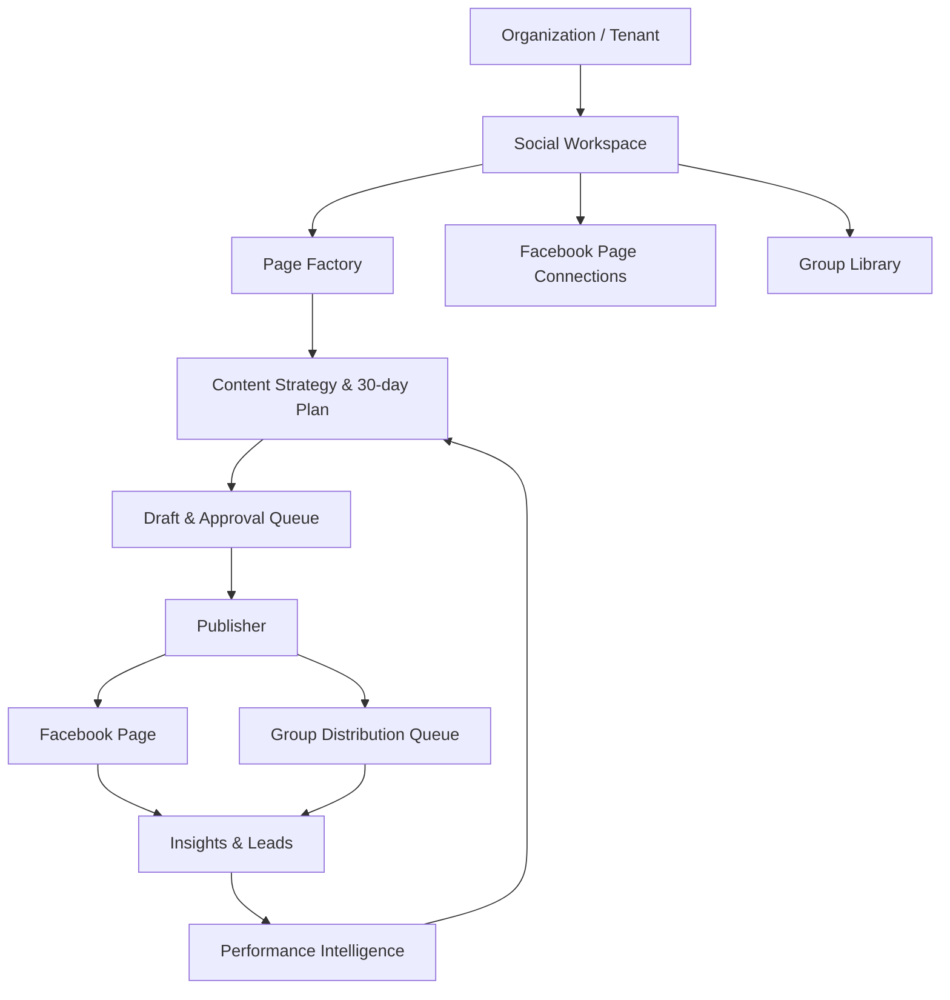

# 30Nice Growth OS — Social Growth OS / Page Factory

## 1. Mục tiêu

Xây dựng module `Social Growth OS` bên trong 30Nice Growth OS để vận hành nhiều Facebook Page theo từng thương hiệu hoặc chủ đề. Module hoạt động như một Social Media Manager: lập chiến lược, tạo kế hoạch nội dung 30/60/90 ngày, tạo bản nháp, duyệt, đăng Page, phân phối có kiểm soát vào Facebook Group, thu lead và tối ưu theo dữ liệu.

Không xây bot đăng nhập Facebook bằng mật khẩu, không spam Group, không tự trả lời inbox không có rào chắn. Toàn bộ kết nối dùng Meta OAuth, Page Access Token và các quyền chính thức được Meta phê duyệt.

## 2. Phạm vi MVP (bản đầu tiên)

### Có trong MVP

- Nhiều Social Workspace theo tenant hiện có.
- Mỗi workspace quản lý nhiều Page/brand.
- Page Factory: tạo brief, định vị, content pillars và kế hoạch 30 ngày.
- Content Planner: quản lý chủ đề, lịch, trạng thái duyệt và kênh phân phối.
- AI tạo caption, hook, CTA, hashtag và brief ảnh/Reel.
- Editorial approval: mặc định phải duyệt trước khi đăng.
- Lên lịch/đăng Facebook Page bằng Meta Graph API sau khi kết nối hợp lệ.
- Group Library: danh sách Group đã phê duyệt, quy tắc từng Group và lịch sử đăng.
- Group Distribution Queue: tạo biến thể bài theo Group; chỉ tự đăng vào Group nếu quyền API thực tế cho phép, còn lại tạo bản nháp để nhân sự đăng thủ công.
- Báo cáo tối thiểu: bài đã lên lịch/đã đăng, tương tác, lead, hiệu quả theo Page/chủ đề/Group.
- Nhật ký audit mọi thao tác kết nối, duyệt, đăng hoặc lỗi.

### Chưa làm ở MVP

- Tự tạo Facebook Page qua API hoặc bot trình duyệt. Hệ thống chỉ tạo **Page launch kit**; việc mở Page thật do quản trị viên thực hiện trong Meta Business Suite.
- Đăng lên trang cá nhân hoặc Group không có quyền API.
- Auto-reply inbox 100% không có duyệt/rule.
- Tự động chạy Ads; chỉ chuẩn bị dữ liệu để dùng ở giai đoạn sau.

## 3. Kiến trúc sản phẩm



`Tenant` là đơn vị cô lập dữ liệu hiện có của hệ thống. Một tenant có thể có nhiều social workspace; mỗi workspace có nhiều Page. Đây là nền tảng để dùng cho hệ thống nội bộ 30 NICE và khách hàng sau này.

## 4. Vai trò và phân quyền

| Vai trò | Quyền Social Growth OS |
|---|---|
| SUPER_ADMIN | Toàn bộ tenant/workspace, tích hợp Meta, cài đặt bảo mật |
| AGENCY_ADMIN | Tạo workspace/Page, duyệt chiến lược, duyệt xuất bản |
| TENANT_ADMIN | Vận hành Page thuộc tenant, duyệt bài, xem báo cáo |
| EDITOR | Tạo/sửa nội dung, gửi duyệt, không kết nối Meta hoặc tự đổi lịch đã duyệt |
| VIEWER | Chỉ xem lịch và báo cáo |

## 5. Mô hình dữ liệu Prisma

Thêm các enum/model sau, tất cả thông tin token phải mã hóa khi lưu và tuyệt đối không trả token về client.

```prisma
enum SocialPlatform { FACEBOOK }
enum SocialWorkspaceStatus { DRAFT ACTIVE PAUSED ARCHIVED }
enum SocialPageStatus { PLANNING SETUP CONNECTED PAUSED ARCHIVED }
enum SocialPlanStatus { DRAFT ACTIVE PAUSED COMPLETED }
enum SocialContentStatus { IDEA DRAFT IN_REVIEW APPROVED SCHEDULED PUBLISHED FAILED SKIPPED }
enum SocialPublishTargetType { PAGE GROUP }
enum SocialPublishStatus { DRAFT PENDING_APPROVAL SCHEDULED PUBLISHED MANUAL_REQUIRED FAILED SKIPPED }
enum SocialGroupMode { MANUAL_ONLY API_ALLOWED DISABLED }
enum SocialGroupStatus { CANDIDATE APPROVED PAUSED REJECTED }

model SocialWorkspace {
  id          String                @id @default(cuid())
  tenantId    String
  name        String
  slug        String
  status      SocialWorkspaceStatus @default(DRAFT)
  objective   String?
  locale      String                @default("vi-VN")
  timezone    String                @default("Asia/Bangkok")
  tenant      Tenant                @relation(fields: [tenantId], references: [id], onDelete: Cascade)
  pages       SocialPage[]
  groups      SocialGroup[]
  plans       SocialContentPlan[]
  createdAt   DateTime              @default(now())
  updatedAt   DateTime              @updatedAt
  @@unique([tenantId, slug])
  @@index([tenantId, status])
}

model SocialPage {
  id              String           @id @default(cuid())
  workspaceId     String
  platform        SocialPlatform   @default(FACEBOOK)
  name            String
  slug            String
  externalPageId  String?
  pageUrl         String?
  status          SocialPageStatus @default(PLANNING)
  category        String?
  targetAudience  Json?
  brandVoice      Json?
  contentPillars  Json?
  postingRules    Json?
  launchKit       Json?
  workspace       SocialWorkspace  @relation(fields: [workspaceId], references: [id], onDelete: Cascade)
  connection      SocialConnection?
  plans           SocialContentPlan[]
  contents        SocialContent[]
  publishTargets  SocialPublishTarget[]
  createdAt       DateTime         @default(now())
  updatedAt       DateTime         @updatedAt
  @@unique([workspaceId, slug])
  @@unique([platform, externalPageId])
  @@index([workspaceId, status])
}

model SocialConnection {
  id                String      @id @default(cuid())
  socialPageId      String      @unique
  encryptedToken    String
  tokenExpiresAt    DateTime?
  grantedScopes     String[]
  connectionStatus  String      @default("CONNECTED")
  lastValidatedAt   DateTime?
  socialPage        SocialPage  @relation(fields: [socialPageId], references: [id], onDelete: Cascade)
  createdAt         DateTime    @default(now())
  updatedAt         DateTime    @updatedAt
}

model SocialContentPlan {
  id            String              @id @default(cuid())
  workspaceId   String
  socialPageId  String
  title         String
  objective     String?
  startDate     DateTime
  endDate       DateTime
  status        SocialPlanStatus    @default(DRAFT)
  strategy      Json?
  workspace     SocialWorkspace     @relation(fields: [workspaceId], references: [id], onDelete: Cascade)
  socialPage    SocialPage          @relation(fields: [socialPageId], references: [id], onDelete: Cascade)
  contents      SocialContent[]
  createdAt     DateTime            @default(now())
  updatedAt     DateTime            @updatedAt
  @@index([workspaceId, status])
  @@index([socialPageId, startDate])
}

model SocialContent {
  id              String              @id @default(cuid())
  planId          String?
  socialPageId    String
  topic           String
  pillar          String?
  format          String              @default("POST")
  title           String?
  caption         String?
  callToAction    String?
  hashtags        String[]
  mediaBrief      Json?
  status          SocialContentStatus @default(IDEA)
  scheduledAt     DateTime?
  approvedAt      DateTime?
  approvedById    String?
  sourcePostId    String?
  plan            SocialContentPlan?  @relation(fields: [planId], references: [id], onDelete: SetNull)
  socialPage      SocialPage           @relation(fields: [socialPageId], references: [id], onDelete: Cascade)
  publishTargets  SocialPublishTarget[]
  createdAt       DateTime             @default(now())
  updatedAt       DateTime             @updatedAt
  @@index([socialPageId, status, scheduledAt])
  @@index([planId])
}

model SocialGroup {
  id             String             @id @default(cuid())
  workspaceId    String
  name           String
  groupUrl       String?
  externalGroupId String?
  status         SocialGroupStatus  @default(CANDIDATE)
  mode           SocialGroupMode    @default(MANUAL_ONLY)
  topics         String[]
  rules          Json?
  dailyPostLimit Int                @default(1)
  cooldownHours  Int                @default(24)
  workspace      SocialWorkspace    @relation(fields: [workspaceId], references: [id], onDelete: Cascade)
  publishTargets SocialPublishTarget[]
  createdAt      DateTime           @default(now())
  updatedAt      DateTime           @updatedAt
  @@index([workspaceId, status])
}

model SocialPublishTarget {
  id              String                  @id @default(cuid())
  socialContentId String
  socialPageId    String
  socialGroupId   String?
  targetType      SocialPublishTargetType
  captionOverride String?
  scheduledAt     DateTime?
  publishedAt     DateTime?
  externalPostId  String?
  status          SocialPublishStatus     @default(DRAFT)
  errorMessage    String?
  content         SocialContent           @relation(fields: [socialContentId], references: [id], onDelete: Cascade)
  socialPage      SocialPage              @relation(fields: [socialPageId], references: [id], onDelete: Cascade)
  socialGroup     SocialGroup?            @relation(fields: [socialGroupId], references: [id], onDelete: SetNull)
  createdAt       DateTime                @default(now())
  updatedAt       DateTime                @updatedAt
  @@index([socialPageId, status, scheduledAt])
  @@index([socialGroupId, status])
}
```

Thêm quan hệ vào `Tenant`:

```prisma
socialWorkspaces SocialWorkspace[]
```

## 6. Luồng Page Factory

### 6.1 Tạo chiến lược Page

Input bắt buộc:

- Tên/chủ đề Page.
- Mục tiêu chính: thương hiệu, inbox, lead hoặc bán hàng.
- Dịch vụ/sản phẩm/khu vực phục vụ.
- Khách hàng mục tiêu.
- Website/hotline/CTA.

AI tạo và lưu `launchKit`:

- Định vị một câu.
- Đề xuất tên Page, username, category và mô tả.
- Brief avatar/cover.
- Brand voice: thân thiện/chuyên gia/cao cấp/đời thường...
- 5–7 content pillars.
- 15 nội dung khởi động và lịch 30 ngày.
- Quy tắc được/không được nói.

### 6.2 Trạng thái

`PLANNING` → `SETUP` → `CONNECTED` → `PAUSED` / `ARCHIVED`.

Chỉ Page trạng thái `CONNECTED` và có `SocialConnection` hợp lệ mới được xuất bản thật.

## 7. Content Planner và AI

### Tỷ trọng mặc định

- 35% kiến thức, giải đáp vấn đề khách hàng.
- 25% niềm tin: ảnh thật, case study, review, con người.
- 25% dịch vụ/ưu đãi/CTA.
- 15% tương tác: hỏi đáp, khảo sát, tình huống.

Tỷ trọng phải tùy chỉnh được theo Page.

### Prompt output bắt buộc (JSON Zod)

Mỗi ngày/bài phải có:

```json
{
  "topic": "...",
  "pillar": "education | trust | conversion | engagement",
  "format": "POST | IMAGE | CAROUSEL | REEL",
  "title": "...",
  "hook": "...",
  "caption": "...",
  "cta": "...",
  "hashtags": ["..."],
  "mediaBrief": {
    "type": "image | video",
    "prompt": "...",
    "assetNotes": "..."
  },
  "suggestedSchedule": "ISO datetime"
}
```

Không tự xuất bản nội dung AI nếu chưa qua `IN_REVIEW` → `APPROVED`, trừ khi Page được quản trị viên bật chế độ auto-publish sau giai đoạn kiểm thử.

## 8. Group Distribution Guardrails

Mỗi Group phải được tạo trong Group Library và có trạng thái `APPROVED` trước khi vào hàng phân phối.

Quy tắc bắt buộc:

- Không dùng cùng caption nguyên văn ở nhiều Group.
- Kiểm tra `dailyPostLimit`, `cooldownHours`, lịch sử đăng và chủ đề phù hợp trước khi tạo queue.
- Không đăng nếu Group mode là `DISABLED`.
- `MANUAL_ONLY`: tạo caption biến thể và nút copy/đánh dấu đã đăng thủ công.
- `API_ALLOWED`: chỉ gọi API sau khi token/quyền Meta phù hợp đã được kiểm tra thành công.
- Ghi toàn bộ lỗi API, lý do từ chối và URL bài đăng.
- Không gắn link/CTA bán hàng nếu `rules` của Group cấm.

## 9. Meta Integration

### Luồng kết nối

1. Admin bấm “Kết nối Facebook”.
2. OAuth callback đổi code lấy user token ngắn hạn.
3. Lấy danh sách Page được quyền quản trị.
4. Người dùng chọn Page để kết nối.
5. Lưu Page ID, token dài hạn/metadata theo chuẩn bảo mật; mã hóa token ở server.
6. Gọi endpoint validate để ghi `grantedScopes` và `lastValidatedAt`.

### Biến môi trường

```env
META_APP_ID=
META_APP_SECRET=
META_GRAPH_VERSION=v25.0
META_REDIRECT_URI=https://admin.30nice.vn/api/integrations/meta/callback
META_WEBHOOK_VERIFY_TOKEN=
TOKEN_ENCRYPTION_KEY=
```

Không đưa `META_APP_SECRET`, access token hoặc `TOKEN_ENCRYPTION_KEY` vào source code, log, client bundle hoặc GitHub.

### API routes dự kiến

```text
GET  /api/integrations/meta/connect
GET  /api/integrations/meta/callback
POST /api/social/pages/:id/validate
POST /api/social/publish/run
POST /api/cron/social-publish
POST /api/cron/social-insights
```

`/api/cron/social-publish` dùng cùng cơ chế `x-cron-secret` hiện tại và chỉ xử lý `APPROVED/SCHEDULED` đến giờ. Cần có retry giới hạn, idempotency theo `SocialPublishTarget.id`, và không retry các lỗi permission không thể tự khắc phục.

## 10. Giao diện Admin

Thêm nhóm sidebar **Social Growth OS**:

```text
Social Growth OS
├── Tổng quan Social                 /admin/social
├── Page Factory                     /admin/social/pages
├── Kế hoạch nội dung                /admin/social/planner
├── Hàng chờ duyệt                   /admin/social/review
├── Lịch đăng & Publisher            /admin/social/publishing
├── Group Distribution               /admin/social/groups
├── Inbox & Lead                     /admin/social/inbox     (phase sau)
└── Báo cáo Social                   /admin/social/analytics
```

### Trang `/admin/social`

- Bộ lọc tenant/workspace/Page.
- KPI: Page active, bài chờ duyệt, bài hẹn lịch, bài đăng thành công, lỗi đăng, lead.
- Timeline 7 ngày.
- Danh sách action cần xử lý: token sắp hết hạn, bài lỗi, bài chờ duyệt, group bị pause.

### Trang Page Factory

- Danh sách Page cùng trạng thái.
- Form tạo Page launch kit.
- Wizard: Brief → AI strategy → duyệt → setup thông tin Meta → connected.

### Trang Planner

- Calendar/kanban theo `IDEA`, `DRAFT`, `IN_REVIEW`, `APPROVED`, `SCHEDULED`, `PUBLISHED`.
- Tạo kế hoạch 30/60/90 ngày theo Page.
- Cho phép nhập bài thủ công, kéo thả lịch và bulk approve khi có quyền.

### Trang Group Distribution

- Group Library với rule, mode và trạng thái.
- Bảng queue: nội dung gốc, caption biến thể, target group, giờ, trạng thái, URL bài/lỗi.

## 11. Tích hợp với module hiện tại

| Module hiện tại | Cách sử dụng trong Social Growth OS |
|---|---|
| Tenant/Organization | Cô lập workspace/Page/lead cho từng khách hàng |
| AI Provider Config | Chọn model tạo strategy, calendar, caption |
| Content Plan | Chia sẻ ý tưởng giữa bài SEO và social; không sửa schema cũ nếu không cần |
| Post/Blog | Có thể chọn bài web làm nguồn tạo social content |
| Media Library | Kho ảnh, video và brief media cho post |
| AutomationJob/Cron | Job xuất bản, đồng bộ insight và nhắc duyệt |
| Audit Log | Log kết nối Meta, approve, publish, lỗi |
| Lead Center | Lưu nguồn Page/bài/Group để đo lead |

## 12. Roadmap triển khai

### Phase A — Nền dữ liệu và UI quản trị

1. Prisma schema + migration.
2. Server queries/actions có phân quyền tenant.
3. Sidebar và dashboard Social.
4. Page Factory CRUD, launch kit và Content Planner CRUD.
5. Seed demo cho 30 NICE.

### Phase B — AI kế hoạch và duyệt nội dung

1. AI generate strategy + 30-day plan bằng structured JSON.
2. Tạo draft caption/media brief.
3. Review queue, approve/reject, edit revision.
4. Lịch hẹn đăng Page.

### Phase C — Meta Page publishing

1. OAuth + encrypted token storage.
2. Chọn Page/validate permissions.
3. Publisher + cron + retry/idempotency.
4. Đồng bộ trạng thái/link bài và insight cơ bản.

### Phase D — Group Distribution

1. Group Library và rules.
2. Caption variations, safe distribution queue.
3. Manual copy workflow trước.
4. Chỉ bật API mode cho Group có quyền được xác minh.

### Phase E — CRM và tối ưu

1. Đồng bộ comment/inbox theo quyền Meta có sẵn.
2. Lead attribution từ Page/Post/Group.
3. Báo cáo hiệu quả, đề xuất nội dung/nhóm chủ đề tuần sau.
4. Chuẩn bị audience/content data cho Meta Ads.

## 13. Tiêu chí nghiệm thu MVP

- Tạo được ít nhất một workspace và ba Page ở trạng thái planning/setup.
- Tạo được launch kit và 30 ngày content cho mỗi Page.
- Tạo/sửa/duyệt/lên lịch content không lẫn tenant/Page.
- Mỗi bài có thể có một target Page và nhiều target Group.
- Group mode `MANUAL_ONLY` không gọi API; hệ thống sinh caption biến thể và lịch sử thao tác.
- Social publisher không thể đăng nếu chưa approved, chưa đến giờ hoặc token invalid.
- Audit log hiển thị thao tác quan trọng.
- `npm run typecheck`, `npm run lint` và production build chạy thành công trước khi merge.

## 14. Quy ước phát triển

- Làm theo App Router/Next.js 16 và TypeScript strict của project.
- Không làm route/client action vượt quyền; kiểm tra session + tenant membership ở server.
- Zod validate mọi request/action input.
- Không dùng `any`; JSON field có type guard/server schema.
- Mọi thao tác publish cần idempotency key và audit log.
- Viết migration thay vì chỉ `prisma db push` cho production.
- Mỗi Phase dùng branch/PR riêng; không commit `.env*`, token hoặc data khách hàng.

## 15. Lệnh đề xuất cho Codex

```text
Đọc AGENTS.md trước khi sửa mã. Hãy triển khai Social Growth OS theo SOCIAL_GROWTH_OS_BUILD_SPEC.md.

Bắt đầu với Phase A. Trước hết hãy rà soát schema Prisma và các patterns hiện có trong src/server/actions, src/server/queries, admin pages, session/permissions và audit logs. Sau đó đề xuất migration và danh sách file thay đổi. Chỉ triển khai Phase A trong PR/branch riêng, không tích hợp Meta OAuth hoặc gọi API Meta ở Phase A.

Yêu cầu: giữ multi-tenant isolation; TypeScript strict; validate bằng Zod; không thay đổi các module CMS/SEO hiện có; dùng UI components hiện có; chạy typecheck, lint và build trước khi kết thúc. Báo cáo rõ migration, route mới, UI mới và các điểm cần biến môi trường ở Phase C.
```
